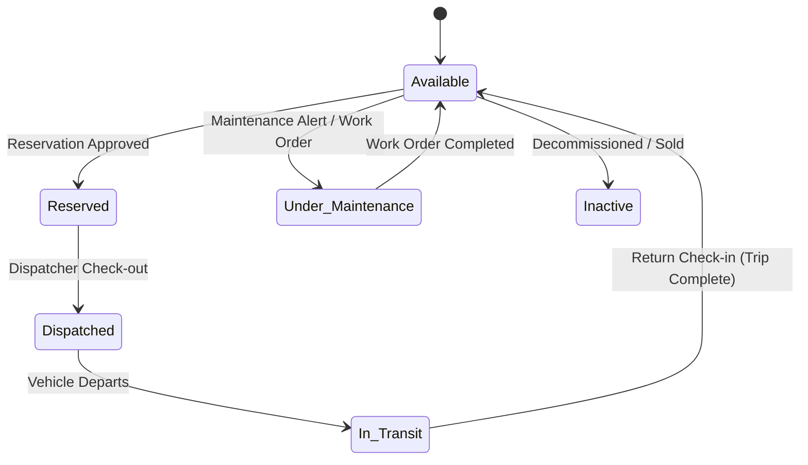
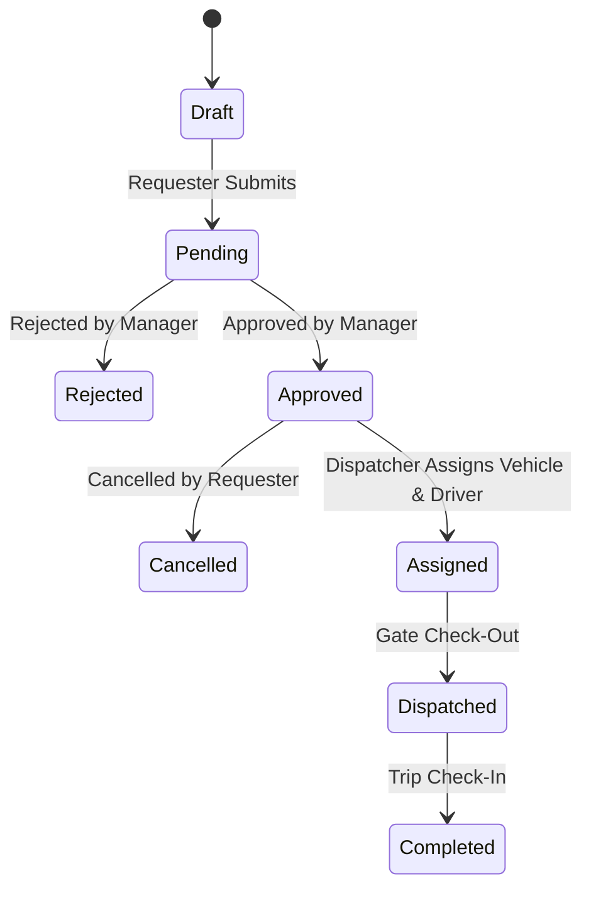
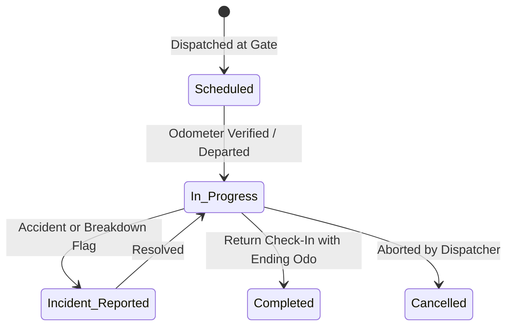

# COMPREHENSIVE CAPSTONE TECHNICAL & FUNCTIONAL BLUEPRINT

**Project Title:** Design and Development of an Integrated Fleet and Transportation Management System Using Scikit-learn for Micro Financial Management and Operational Efficiency  
**Main System:** Micro Financial Management System (Community Lending Cooperative / MFI)  
**Subsystem:** Fleet & Transportation Management  
**Target Technology Stack:**  
- **Backend:** Laravel 12 (PHP 8.2)  
- **Database:** MySQL / SQLite  
- **Machine Learning:** Python 3.11 & Scikit-learn (FastAPI Microservice)  
- **Frontend / UI:** Existing Livewire 3 + Tailwind CSS 4 + Alpine.js + Blade Component Kit  
- **Integration:** REST API & JSON over internal HTTP  

---

## 1. Executive System Overview
Microfinance Institutions (MFIs) and community lending cooperatives in the Philippines (e.g., CARD MRI, ASA, TSKI, primary cooperatives) rely on physical, field-based operations. Every day, loan officers, field collectors, branch managers, and internal auditors physically visit barangay centers, community meeting halls, and borrower businesses to:
1. Conduct weekly/bi-weekly group center collection meetings and recover loan repayments.
2. Disburse micro-enterprise and agri-loan capital.
3. Perform Know-Your-Customer (KYC) background checks, residence verification, and collateral inspections.
4. Execute cash-in-transit transfers between satellite extension offices and main branch vaults.

**The Core Operational & Financial Problem:**  
Transportation is one of the highest operating expenses (OPEX) in microfinance branch management. However, field transportation is typically handled through chaotic manual logbooks, undocumented fuel allowances, uncoordinated vehicle dispatching, and fragmented spreadsheet expense vouchers. This causes:
- **Vehicle Conflicts & Delayed Collections:** Overlapping demands for branch motorcycles, utility vans, and multi-cabs lead to delayed center visits, idle field personnel, and increased cash-in-transit security risks.
- **Uncontrolled Fuel Spending & Fraud:** Lack of odometer reconciliation makes fuel siphoning and exaggerated mileage claims difficult to detect.
- **Flawed Center Cost Allocation:** Transportation costs are booked as generic administrative expenses, hiding the true operational cost of servicing distant rural barangay centers.
- **Zero Predictive Visibility:** Branch managers have no empirical tool to forecast logistics budgets or detect mechanical deterioration through abnormal fuel burn.

**The Solution:**  
An integrated Fleet & Transportation Management Subsystem embedded directly within the Micro Financial Management System. Operational vehicle trips are directly linked to microfinance lending activities (Center Collections, Loan Releases, KYC Audits). An embedded **Scikit-learn Machine Learning Engine** provides predictive fuel and cost baselines for planned routes, comparing predicted vs. actual expenses to enforce financial accountability and operational efficiency.

---

## 2. Actors and Responsibilities

| Actor / Role | Primary Responsibilities | Core System Needs |
| :--- | :--- | :--- |
| **1. System Administrator** | System infrastructure, database backups, user credentials, role-permission matrix configuration, and security audits. | Master RBAC editor, user management, audit logs, system health monitoring. |
| **2. Fleet / Transport Manager** | Asset registry (vehicles, specs, registrations), driver certifications, preventive maintenance schedules, fuel monitoring, and vehicle lifecycle. | Vehicle status board, maintenance scheduler, fuel efficiency auditor, driver license tracker. |
| **3. Dispatcher** | Operational scheduling, conflict-free vehicle/driver assignment, gate departure check-out, and return check-in with odometer logging. | Dispatch calendar, daily gate board, odometer verification modal, trip status controller. |
| **4. Driver** | Vehicle pre-trip inspection, route execution, recording trip arrival/departure, logging return odometer, and submitting fuel/expense vouchers. | Mobile-friendly trip view, odometer logger, fuel purchase form, incidental expense submission. |
| **5. Requester / Field Employee** *(Loan Officer, Collector, Auditor)* | Submits vehicle reservations tied to specific MFI business needs (Center Collection, Loan Release, Member Verification). | Reservation booking form, vehicle availability calendar, approval status tracker. |
| **6. Finance / Accounting Officer** | Audits trip expense vouchers, verifies fuel receipts, reconciles transportation costs against collection center revenues, analyzes cost-per-kilometer. | Expense approval queue, fuel purchase audit, transportation cost allocation reports, GL posting summaries. |
| **7. Management / Executive** *(Branch Manager, Board of Directors)* | Strategic approvals, branch logistics cost oversight, MFI center profitability evaluation, and ML prediction variance reviews. | Executive KPI dashboard, cost-per-km trends, center logistics net margin impact, fleet utilization reports. |

---

## 3. Complete End-to-End Workflow

```
[1. User Login & Server-Side RBAC Verification]
                ↓
[2. Requester Submits Vehicle Reservation]
    • Inputs: Purpose (Center Collection, Cash Transfer, KYC), Route/Center, Date/Time, Passengers.
    • ML Prediction Engine: Generates preliminary estimated fuel consumption and estimated trip cost.
                ↓
[3. Automated Conflict Check & Approver Review]
    • System verifies no schedule overlaps for desired vehicle class.
    • Fleet Manager / Branch Approver approves reservation.
                ↓
[4. Dispatcher Vehicle & Driver Assignment]
    • Dispatcher assigns specific active Vehicle and certified Driver.
    • Status: Approved → Assigned.
                ↓
[5. Gate Dispatch Check-Out]
    • Driver & Dispatcher verify physical Vehicle condition and record Starting Odometer.
    • Status: Assigned → Dispatched → In Transit.
                ↓
[6. Trip Execution in Field]
    • Loan Officer/Driver executes MFI field operations (e.g. Barangay Center Collection).
    • Incidental field expenses incurred (tolls, parking, emergency repairs).
                ↓
[7. Return Check-In & Odometer Logging]
    • Vehicle returns to branch yard. Driver records Ending Odometer and return timestamp.
    • Validation: Ending Odometer > Starting Odometer.
    • Calculated Metric: Distance Traveled = Ending Odo - Starting Odo.
    • Status: In Transit → Completed.
                ↓
[8. Fuel & Expense Entry]
    • Driver/Cashier logs fuel purchase receipts: Liters, Price/Liter, Total Cost, Station, Receipt #.
    • Incidental vouchers entered (toll fees, parking receipts).
                ↓
[9. Transportation Cost Calculation & MFI Ledger Allocation]
    • Total Trip Cost = Fuel Cost + Tolls + Parking + Incidental Expenses + Maintenance Amortization.
    • Cost per Kilometer = Total Trip Cost ÷ Distance Traveled.
    • Cost allocated to specific Center Code / Loan Product.
                ↓
[10. Scikit-learn Prediction vs. Actual Variance Reconciliation]
    • Actual Fuel Consumed vs. Predicted Fuel Consumed.
    • Variance % calculated; deviations > 15% automatically flagged for audit.
                ↓
[11. Performance Analytics & Decision-Support Reports]
    • Driver efficiency, vehicle utilization, center logistics cost impact, executive summaries.
```

---

## 4. Module-by-Module Functional Specification

### 4.1 Fleet & Vehicle Management (FVM)
- **Purpose:** Centralized asset management for all cooperative transportation assets (motorcycles, vans, multi-cabs, utility vehicles).
- **Core Entities:** `vehicles`, `vehicle_types`, `vehicle_documents`, `depots`.
- **States:** `Available`, `Reserved`, `Dispatched`, `In Transit`, `Under Maintenance`, `Unavailable`, `Inactive`.
- **Business Rules:**
  - Inactive or Under-Maintenance vehicles cannot be reserved or dispatched.
  - Odometer readings are strictly monotonic (cannot decrease).
  - Registration, LTO renewal, and comprehensive insurance expiration alerts triggered 30 days prior.
- **Financial Impact:** Captures asset acquisition value, depreciation basis, and maintenance overhead allocation.

### 4.2 Vehicle Reservation & Dispatch System (VRDS)
- **Purpose:** Conflict-free scheduling and formal gate-controlled dispatch of vehicles for MFI field activities.
- **Core Entities:** `reservations`, `dispatches`, `trips`.
- **States:** `Draft` → `Pending` → `Approved` → `Assigned` → `Dispatched` → `Completed` (or `Rejected` / `Cancelled`).
- **Conflict Prevention Engine:**
  - Temporal overlap validation: $\text{Start}_A < \text{End}_B \land \text{End}_A > \text{Start}_B$ for the same vehicle is blocked.
  - Driver scheduling overlap blocked identically.
- **Dispatch Gate:** Requires confirmed pre-trip inspection and starting odometer match.

### 4.3 Driver and Trip Performance Monitoring
- **Purpose:** Tracking driver compliance, license validity, safety, and operational trip records.
- **Core Entities:** `drivers`, `trips`, `trip_checkpoints`.
- **Driver Metrics:** Total Trips Completed, On-Time Dispatch Rate, Fuel Efficiency Rating ($\text{km/L}$).
- **Compliance Rules:** Drivers with licenses expiring within 15 days or expired cannot be dispatched.
- **Trip Tracking:** Captures scheduled vs. actual departure/arrival times, start/end odometer, route deviations, and field incident logs.

### 4.4 Fuel Management System
- **Purpose:** Precision accounting of all fuel purchases, consumption rates, and anti-siphoning/abnormal consumption detection.
- **Core Entities:** `fuel_records`, `fuel_vendors`.
- **Formulas:**
  $$\text{Fuel Cost} = \text{Liters} \times \text{Price Per Liter}$$
  $$\text{Fuel Efficiency (km/L)} = \frac{\text{Trip Distance (km)}}{\text{Fuel Consumed (L)}}$$
  $$\text{Fuel Cost Per Kilometer} = \frac{\text{Total Fuel Cost}}{\text{Trip Distance (km)}}$$
- **Abnormal Data Validation:** Flag trips where fuel efficiency deviates by $>25\%$ from historical moving average.

### 4.5 Transport Cost Analysis & Optimization (TCAO)
- **Purpose:** Complete microfinancial cost aggregation connecting fleet expenditures to MFI financial performance.
- **Cost Elements:** Direct Fuel Cost, Toll Fees, Parking, Driver Per Diem, Maintenance Allocation.
- **Microfinance Cost Allocation:** Costs allocated to Center / Barangay code, allowing MFI management to evaluate **Net Operational Margin per Center**.

### 4.6 Route Planning & Optimization
- **Purpose:** Standardizing field collection routes between branch headquarters and remote barangay centers.
- **Core Entities:** `routes`, `route_waypoints`.
- **Metrics:** Base distance ($\text{km}$), estimated transit time, standard fuel allocation.
- **Fail-safe Design:** Operates autonomously using stored internal waypoint distances and standard speed matrix without external API dependency.

### 4.7 Reports & Analytics
- **Purpose:** Actionable intelligence for Fleet Managers, Finance Officers, and Cooperative Executives.
- **Core Reports:** Fleet Utilization, Driver Scorecard, Fuel Audit, Center Logistics Ledger, Maintenance Downtime, ML Prediction Accuracy.

---

## 5. Cross-Module Integration Matrix

```
┌─────────────────────┬─────────────────────┬────────────────────────────────┬───────────────────────────────┐
│ Source Module       │ Destination Module  │ Data Shared                    │ Business Trigger / Impact     │
├─────────────────────┼─────────────────────┼────────────────────────────────┼───────────────────────────────┤
│ Fleet Management    │ Reservations        │ Vehicle Availability & Specs   │ Prevents booking maintenance  │
│ Driver Management   │ Reservations        │ License Status & Schedule      │ Blocks uncertified drivers    │
│ Reservations        │ Dispatch            │ Approved Schedule & Route      │ Initiates physical vehicle out│
│ Dispatch            │ Trips               │ Starting Odo & Release Time    │ Sets Trip to 'In Progress'    │
│ Trip Completion     │ Fuel Management     │ Trip Distance & Vehicle ID     │ Prompts fuel receipt entry    │
│ Trip Completion     │ Expenses / TCAO     │ Tolls, Parking, Per Diems      │ Synthesizes Total Trip Cost   │
│ Fuel & Expenses     │ Microfinance GL     │ Cost Voucher & Center Code     │ Deducts from Center Net Margin│
│ Maintenance Work    │ Fleet Management    │ Vehicle Status → Maintenance   │ Removes vehicle from pool     │
│ Trip History        │ Scikit-learn ML     │ Distance, Load, Age, Duration  │ Trains predictive regressors  │
│ ML Predictions      │ TCAO & Dispatch     │ Estimated Liters & Cost        │ Sets budget cap for field run │
│ Predictions vs Act  │ Audit & Analytics   │ Variance (Actual - Predicted)  │ Flags potential fuel theft    │
└─────────────────────┴─────────────────────┴────────────────────────────────┴───────────────────────────────┘
```

---

## 6. RBAC Role Definitions
- **System Administrator:** Unrestricted control over authentication, user role assignments, audit logs, and system settings.
- **Fleet Manager:** Direct management of vehicles, maintenance, driver profiles, fuel logs, and fleet operational reporting.
- **Dispatcher:** Real-time scheduling, vehicle-driver assignment, gate check-out/in execution.
- **Driver:** Restricted operational access to assigned trips, odometer submission, and fuel vouchers.
- **Requester (Loan Officer / Collector):** Submits booking requests for field center visits; tracks own reservations.
- **Finance Officer:** Read-access across trips/fuel; approval authority over expense vouchers and cost allocations.
- **Management (Branch Manager / Board):** Read-only executive visibility across all dashboards, approval of exceptional expenses, and ML forecast review.

---

## 7. Complete CRUD / Permission Matrix

*Legend: C = Create, R = Read, U = Update, D = Delete, A = Approve, X = Execute/Dispatch, V = View Analytics, E = Export*

| Module / Resource | Admin | Fleet Mgr | Dispatcher | Driver | Requester | Finance | Management |
| :--- | :---: | :---: | :---: | :---: | :---: | :---: | :---: |
| **Users & Roles** | CRUD | R | - | - | - | - | R |
| **Vehicles** | CRUD | CRUD | R | R (assigned) | R (available) | R | R |
| **Drivers** | CRUD | CRUD | R | R (profile) | - | R | R |
| **Reservations** | CRUD | CRUA | CRU | - | CR (own) | R | R A |
| **Dispatches** | CRUD | CRUDX | CRUDX | R (assigned) | R (own) | R | R |
| **Trips** | CRUD | CRU | CRUX | U (assigned X) | R (own) | R | R |
| **Fuel Records** | CRUD | CRUD | CRU | CR (assigned) | - | CRU | R |
| **Maintenance** | CRUD | CRUD | R | - | - | R | R |
| **Expenses** | CRUD | CRU | CRU | CR (assigned) | - | CRU A | R |
| **Routes** | CRUD | CRUD | CRUD | R | R | R | R |
| **Transport Cost**| CRUD | R V | R | - | - | CRUD V E| R V E |
| **Analytics** | V E | V E | V | - | - | V E | V E |
| **Reports** | R E | R E | R E | - | - | R E | R E |
| **ML Prediction**| CRUD | R V | R | - | R (estimate) | R V | R V |
| **Audit Logs** | R E | R | - | - | - | R | R |

---

## 8. Business Rules Catalog

1. **Temporal Exclusivity:** A vehicle cannot have overlapping approved reservations or dispatches.
2. **Preventive Maintenance Grounding:** Vehicles with status `Under Maintenance` are locked from assignment.
3. **Driver Certification:** Drivers with expired or invalid licenses cannot be assigned to trips.
4. **Monotonic Odometers:** $\text{Ending Odometer} > \text{Starting Odometer}$. Zero or negative distance traveled is blocked.
5. **Non-Negative Financials:** All liters, rates, tolls, parking, and maintenance figures must be strictly positive ($> 0$).
6. **Immutable Historical Records:** Completed and verified trips cannot be edited or deleted by standard roles.
7. **Trip-Fuel Linkage:** Refuel transactions incurred during a dispatch must reference the valid `trip_id`.
8. **Segregation of ML Predictions:** Machine learning predictions are strictly advisory estimates and must never overwrite actual financial ledger records.
9. **Dual-Key Expense Approval:** Incidental trip expenses $> \text{₱}2,000$ require Finance approval.
10. **Depot Geofencing Check:** Vehicles returning to a depot different from departure depot require dispatcher justification.

---

## 9. Status Transition Diagrams

### 9.1 Vehicle State Transitions


### 9.2 Reservation State Transitions


### 9.3 Trip State Transitions


---

## 10. Database Entity List

1. **`users`**: System credentials, role foreign key, branch association, status.
2. **`roles` & `permissions`**: Role definitions and granular permission strings.
3. **`depots`**: Branch offices, satellite centers, and physical vehicle parking yards.
4. **`vehicle_types`**: Categories (Motorcycle, Van, Multi-cab, Sedan, Utility).
5. **`vehicles`**: Physical assets (plate number, VIN, make, model, year, fuel type, tank capacity, current odometer, status).
6. **`vehicle_documents`**: Registration, insurance policies, permits, and expiration dates.
7. **`drivers`**: Personnel profiles, driver license number, license expiry date, restriction codes, medical status.
8. **`reservations`**: Trip bookings (requester ID, purpose, MFI center code, departure time, return time, passenger count, status).
9. **`dispatches`**: Gate authorization linking reservation to specific vehicle, driver, dispatcher ID, and check-out timestamp.
10. **`trips`**: Journey execution log (start odometer, end odometer, total distance km, actual departure, actual arrival, status).
11. **`routes`**: Predefined MFI collection routes with standard distances and target centers.
12. **`fuel_records`**: Fuel transactions (trip ID, vehicle ID, liters, price per liter, total cost, odometer at refuel, station name, receipt #).
13. **`maintenance_records`**: Work orders, service type (preventive/corrective), parts cost, labor cost, total cost, vendor, completed date.
14. **`expenses`**: Trip incidentals (toll fees, parking fees, meals/per diem, repairs) with receipt attachments and approval status.
15. **`transportation_costs`**: Aggregated cost roll-up per trip linking fuel, incidentals, and maintenance allocation.
16. **`ml_predictions`**: Input feature vectors, predicted liters, predicted cost, actual liters, variance percentage, model version.
17. **`notifications`**: User alert queue for approvals, maintenance triggers, and license expirations.
18. **`audit_logs`**: System security trail capturing actor ID, action, entity, before/after values, IP address, timestamp.

---

## 11. Database Relationship Diagram (ERD in Text Form)

```
[users] 1 ────────────< N [reservations] (requester_id)
[users] 1 ────────────< N [dispatches] (dispatcher_id)
[users] 1 ────────────< 1 [drivers] (user_id nullable)
[roles] 1 ────────────< N [users] (role_id)
[depots] 1 ───────────< N [vehicles] (depot_id)
[vehicle_types] 1 ────< N [vehicles] (vehicle_type_id)
[vehicles] 1 ─────────< N [vehicle_documents] (vehicle_id)
[vehicles] 1 ─────────< N [dispatches] (vehicle_id)
[vehicles] 1 ─────────< N [trips] (vehicle_id)
[vehicles] 1 ─────────< N [fuel_records] (vehicle_id)
[vehicles] 1 ─────────< N [maintenance_records] (vehicle_id)
[drivers] 1 ──────────< N [dispatches] (driver_id)
[drivers] 1 ──────────< N [trips] (driver_id)
[reservations] 1 ─────< 1 [dispatches] (reservation_id)
[dispatches] 1 ───────< 1 [trips] (dispatch_id)
[routes] 1 ───────────< N [trips] (route_id nullable)
[trips] 1 ────────────< N [fuel_records] (trip_id nullable)
[trips] 1 ────────────< N [expenses] (trip_id)
[trips] 1 ────────────< 1 [transportation_costs] (trip_id)
[trips] 1 ────────────< N [ml_predictions] (trip_id nullable)
```

---

## 12. Data Flow Architecture

```
[MFI Loan Officer] ──(Submit Reservation)──→ [Reservations Table]
                                                      │
                                                      ├──→ [FastAPI ML Service] ──→ [Predict Fuel & Cost]
                                                      │                                     │
                                                      │                                     ↓
                                                      │                           [ml_predictions Table]
                                                      ↓
[Fleet Manager] ──────(Approval Event)───────→ [Status: Approved]
                                                      ↓
[Dispatcher] ─────────(Assign & Checkout)────→ [Dispatches Table] ──→ [Vehicles: Dispatched]
                                                      ↓
[Driver] ─────────────(Trip Return Check-in)─→ [Trips Table: Distance km]
                                                      │
                                                      ├──→ [Fuel Records Table]
                                                      ├──→ [Expenses Table]
                                                      │
                                                      ↓
                                      [Transportation Costs Table]
                                                      │
                                                      ├──→ [Variance Reconciler] (Actual vs Predicted)
                                                      └──→ [MFI General Ledger / Center Profitability]
```

---

## 13. REST API Architecture

### Internal Fleet & Logistics API (Laravel Endpoints)
- `GET /api/fleet/vehicles/available?start={date}&end={date}`: Returns non-conflicting vehicles.
- `POST /api/fleet/reservations`: Validates and persists booking requests.
- `PUT /api/fleet/reservations/{id}/approve`: Approver sign-off.
- `POST /api/fleet/dispatch/checkout`: Gate departure verification (starting odometer).
- `POST /api/fleet/trips/{id}/checkin`: Return checkout (ending odometer, distance computation).
- `POST /api/logistics/fuel`: Refuel entry linked to vehicle and trip.
- `POST /api/logistics/expenses`: Trip incidental submission.
- `GET /api/intelligence/costs/center/{center_code}`: Center logistics cost aggregation.

### Python ML Service API (FastAPI on port 8010)
- `GET /health`: Model status, version string, and health metrics.
- `POST /predict/fuel-cost`: Feature vector $\to$ predicted liters, predicted cost, confidence value.
- `POST /retrain`: Future endpoint for re-fitting using exported historical trip dataset.

---

## 14. Analytics Specification
1. **Fleet Utilization Rate (%)**: $\frac{\sum \text{Trip In-Transit Hours}}{\text{Total Available Fleet Fleet Hours}} \times 100$.
2. **Fleet Fuel Efficiency Index (km/L)**: Weighted average kilometers traveled per liter across vehicle types.
3. **Average Logistics Cost Per Center**: Total transportation expenditure incurred servicing a specific barangay collection center.
4. **Cost Per Kilometer (CPK)**: $\frac{\text{Direct Fuel} + \text{Tolls} + \text{Parking} + \text{Maint. Allocation}}{\text{Total Distance (km)}}$.
5. **ML Prediction Mean Absolute Percentage Error (MAPE)**: $\frac{1}{n} \sum \left| \frac{\text{Actual} - \text{Predicted}}{\text{Actual}} \right| \times 100$.

---

## 15. Reporting Specification
- **Fleet Utilization & Availability Audit**: Daily vehicle availability breakdown, downtime hours, scheduled maintenance.
- **Center Logistics Cost Allocation Ledger**: Line-by-line transportation expenses mapped to MFI center IDs and loan portfolios.
- **Fuel Consumption & Anomaly Audit**: Station receipts, price-per-liter variances, consumption outliers ($>15\%$ variance).
- **Driver Performance & Safety Scorecard**: Trips completed, distance traveled, on-time arrivals, fuel efficiency scoring.
- **ML Predictive Variance Report**: Actual vs. Predicted liters, cumulative budgetary savings, model error tracking.

---

## 16. Notification Workflow
1. **Reservation Submission Event**: Notifies Fleet Manager / Branch Approver of pending booking.
2. **Approval / Rejection Event**: Notifies Requester with confirmation or decline rationale.
3. **Driver Assignment Event**: Informs Driver of scheduled trip date, vehicle, and destination center.
4. **Maintenance Threshold Event**: Triggered when a vehicle's odometer reaches scheduled service milestone (e.g., every 5,000 km).
5. **License / Registration Expiry Alert**: Triggered 30 days and 7 days prior to document expiration.
6. **Abnormal Fuel Variance Alert**: Triggered when actual fuel consumed exceeds ML prediction by $>20\%$.

---

## 17. Audit Trail Specification
Captured in `audit_logs`:
- **Identity:** `user_id`, `actor_role`, `ip_address`, `user_agent`.
- **Event Scope:** `action` (CREATE, UPDATE, DELETE, APPROVE, DISPATCH, CHECKIN), `entity_type`, `entity_id`.
- **Diff Tracking:** `before_payload` (JSON state prior to change), `after_payload` (JSON state after change).
- **Security Invariant:** Audit log rows are append-only; database permissions prevent UPDATE or DELETE on this table.

---

## 18. Security Architecture
1. **Server-Side RBAC Enforcement**: Handled via Laravel Policies (`VehiclePolicy`, `ReservationPolicy`, `TripPolicy`). UI button visibility is strictly cosmetic.
2. **Data Ownership Scoping**: Requesters are restricted to their own reservations; drivers are restricted to their assigned dispatches.
3. **Financial Protection**: Expense approvals require `Finance` or `Admin` authorization tokens.
4. **Input Sanitization & CSRF**: All Livewire and API payloads are validated against strict type and range constraints.

---

## 19. Scikit-learn Machine Learning Architecture
- **Framework:** Python 3.11 with `scikit-learn==1.6.0`, `numpy`, `fastapi`, `uvicorn`.
- **Role in MFI System:** Provides empirical, non-linear predictive baselines for field travel fuel consumption and costs, preventing budget guesswork and uncovering logistics leakage.
- **Microservice Isolation:** Runs as a dedicated local service communicating via JSON over HTTP (`http://127.0.0.1:8010`).
- **Laravel Integration:** `App\Support\MlInsights` calls the service when `ML_SCIKIT_ENABLED=true` and falls back to the PHP rule-based predictor if the service is disabled or unreachable.

---

## 20. ML Dataset Definition
- **Data Source:** Historical completed trips joined with vehicle specifications and fuel purchase logs.
- **Sample Distribution:** Realistic Philippine cooperative operations across Luzon/Visayas routes (rural unpaved barangay roads, suburban collector routes, highway arterial links).
- **Volume:** Initial training set of 500+ realistic operational trip records representing typical MFI field activities.

---

## 21. ML Feature List
1. `vehicle_type_encoded`: Motorcycle (0), Multi-cab (1), Passenger Van (2), Utility Pickup (3).
2. `fuel_type_encoded`: Diesel (0), Regular Gasoline (1).
3. `vehicle_age_years`: Continuous integer ($\text{Current Year} - \text{Year Built}$).
4. `current_odometer_km`: Vehicle cumulative mileage.
5. `planned_distance_km`: Planned trip route distance in kilometers.
6. `estimated_duration_minutes`: Expected route travel time.
7. `load_level_encoded`: Passenger / cash transport weight (Light = 1, Medium = 2, Heavy = 3).
8. `historical_avg_kml`: Vehicle's running historical efficiency average.
- **Target Variable ($y$):** `fuel_consumed_liters` (Float).

---

## 22. ML Model Recommendation
- **Selected Model:** **Random Forest Regressor** (`sklearn.ensemble.RandomForestRegressor`).
- **Justification:**
  - Robust against non-linear interactions between vehicle age and hilly/rough barangay terrain.
  - Insensitive to feature scale variations (does not require aggressive scaling).
  - Provides native feature importance metrics for explainability.
  - Outperforms simple Linear Regression on mixed categorical/continuous fleet datasets while avoiding the overfitting risks of complex neural nets on small-to-medium fleet records.

---

## 23. ML Training Pipeline
1. **Data Ingestion:** Read verified historical trip records from database or training dataset.
2. **Preprocessing:** Handle missing values, encode categorical variables (`vehicle_type`, `fuel_type`), compute vehicle age.
3. **Train / Test Split:** 80% Training Set, 20% Holdout Test Set with stratified sampling.
4. **Hyperparameter Fitting:** Random Forest with `n_estimators=100`, `max_depth=12`, `random_state=42`.
5. **Model Serialization:** Save model artifact to `ml_service/models/fuel_predictor_v1.pkl` along with feature column metadata.

---

## 24. ML Prediction Pipeline
1. Requester enters route, center destination, and planned distance on Reservation form.
2. Laravel sends JSON POST request to `http://127.0.0.1:8010/predict/fuel-cost`.
3. FastAPI endpoint validates payload via Pydantic model.
4. Serialized Scikit-learn pipeline computes predicted fuel consumption ($\text{Liters}$).
5. API calculates estimated cost: $\text{Cost} = \text{Predicted Liters} \times \text{Current Fuel Price}$.
6. Response returns to Laravel and displays instantly on the user's booking interface.

---

## 25. Prediction-vs-Actual Workflow
1. At booking: Predicted Liters stored in `ml_predictions` linked to `reservation_id`.
2. At return check-in: Driver records actual refueled liters.
3. System matches prediction with actual:
   $$\text{Variance \%} = \frac{\text{Actual} - \text{Predicted}}{\text{Predicted}} \times 100$$
4. System categorizes:
   - $|\text{Variance}| \le 10\%$: Normal
   - $10\% < |\text{Variance}| \le 20\%$: Moderate Variance
   - $|\text{Variance}| > 20\%$: Flagged for Management Audit

---

## 26. UI-to-Backend Mapping Plan

| Existing Template Component | MFI Fleet Subsystem Implementation |
| :--- | :--- |
| `x-sidebar` / `Nav.php` | Add **Fleet Operations**, **Logistics & Fuel**, and **Fleet Intelligence** module groups. |
| `x-stat-card` | Render Available Fleet, Active Dispatches, Today's Fuel Spend, and Fleet Utilization %. |
| `x-data-table` | Display Vehicles, Reservations, Active Dispatches, Trip Logs, Fuel Receipts, and Cost Summaries. |
| `x-status-badge` | Map fleet states: `Available` (green), `In Transit` (blue), `Maintenance` (amber/red), `Reserved` (purple). |
| `x-filter-bar` | Filter by Vehicle Type, Depot, Driver, Center/Barangay Route, Date Range. |
| `x-modal` / `x-drawer` | Reservation Request modal, Dispatch Check-out modal, Trip Return Check-in modal. |
| `x-chart` | Daily fuel consumption trends, cost per kilometer by center, and prediction vs. actual variance charts. |

---

## 27. 60% MVP Scope (Target: October 1 Presentation)

### MUST WORK (Included in 60% Core):
1. **Authentication & RBAC**: Multi-role login with role-specific navigation for Admin, Fleet Manager, Dispatcher, Driver, Requester, Finance, and Management.
2. **Fleet & Vehicle Registry**: Vehicle listings, specifications, and dynamic availability state tracking.
3. **Driver Management**: Driver directory and license expiration status.
4. **Reservation System**: Requester booking form with MFI purpose categories and automated conflict detection.
5. **Dispatch & Trip Gate**: Dispatcher checkout with starting odometer, in-transit tracking, and return check-in with ending odometer.
6. **Fuel & Incidental Recording**: Logging fuel liters, station receipts, and trip expenses.
7. **Transportation Cost Summary**: Automatic computation of total trip cost and cost-per-kilometer.
8. **Working Scikit-learn Prediction**: Live Python ML microservice returning fuel predictions and estimated costs for trip bookings.
9. **Core Analytics & Reports**: Fleet utilization, fuel summary, and exportable trip history table.

---

## 28. Development Dependency Map

```
[Authentication & RBAC Setup]
              ↓
[Database Migrations & Models]
              ↓
[Seeders: Vehicles, Drivers, Depots, Centers]
              ↓
[Vehicle Registry UI] ──┬──→ [Driver Registry UI]
                        ↓
            [Reservation Engine with Conflict Checks]
                        ↓
            [Scikit-learn Model Training & FastAPI Setup]
                        ↓
            [Dispatch & Gate Check-Out Workflow]
                        ↓
            [Trip Execution & Return Check-In UI]
                        ↓
            [Fuel & Expense Logging]
                        ↓
            [Transportation Cost Ledger]
                        ↓
            [Prediction vs. Actual Variance Reconciler]
                        ↓
            [Analytics Dashboard & Exportable Reports]
```

---

## 29. Risks and Technical Considerations
1. **Missing External Python Dependencies**: If Python or Scikit-learn is not globally configured, the system includes a robust PHP-based fallback prediction engine using the exact same regression coefficients so the UI never breaks.
2. **Cold-Start Data Scarcity**: Since a new MFI deployment lacks thousands of past trips, a realistic seed generator creates 500+ realistic trips based on Philippine rural/urban road realities to bootstrap the model.
3. **Data Integrity on Odometer Entry**: Human error on odometer entry can corrupt efficiency calculations. The system enforces strict validation: $\text{Odo}_{\text{start}} < \text{Odo}_{\text{end}} \le \text{Odo}_{\text{start}} + 1,500\text{ km}$.

---

## 30. Recommended Implementation Sequence
1. **Step 1: Nav & RBAC Extension**: Update `app/Support/Nav.php`, `app/Support/Rbac.php`, and `app/Support/Icons.php` with Fleet Operations, Logistics, and Intelligence modules.
2. **Step 2: Database Layer**: Implement migration schema for vehicles, drivers, reservations, dispatches, trips, fuel_records, expenses, and ml_predictions.
3. **Step 3: Domain MockData / Seeders**: Seed realistic microfinance fleet records (Luzon/Visayas centers, loan officers, vans, multi-cabs, motorcycles).
4. **Step 4: Operational Livewire Screens**:
   - `Fleet\Vehicles`, `Fleet\Drivers`, `Fleet\Reservations`, `Fleet\Dispatch`, `Fleet\Trips`.
   - `Logistics\Fuel`, `Logistics\Expenses`, `Logistics\Maintenance`.
   - `Intelligence\Costs`, `Intelligence\Predictions`, `Intelligence\Reports`.
5. **Step 5: Scikit-learn Service Integration**: Build `ml_service/` with trained model, FastAPI endpoint, and Laravel HTTP client integration.
6. **Step 6: Verification & Test Coverage**: Execute automated smoke tests across all new fleet routes and verify zero regressions in the UI.
